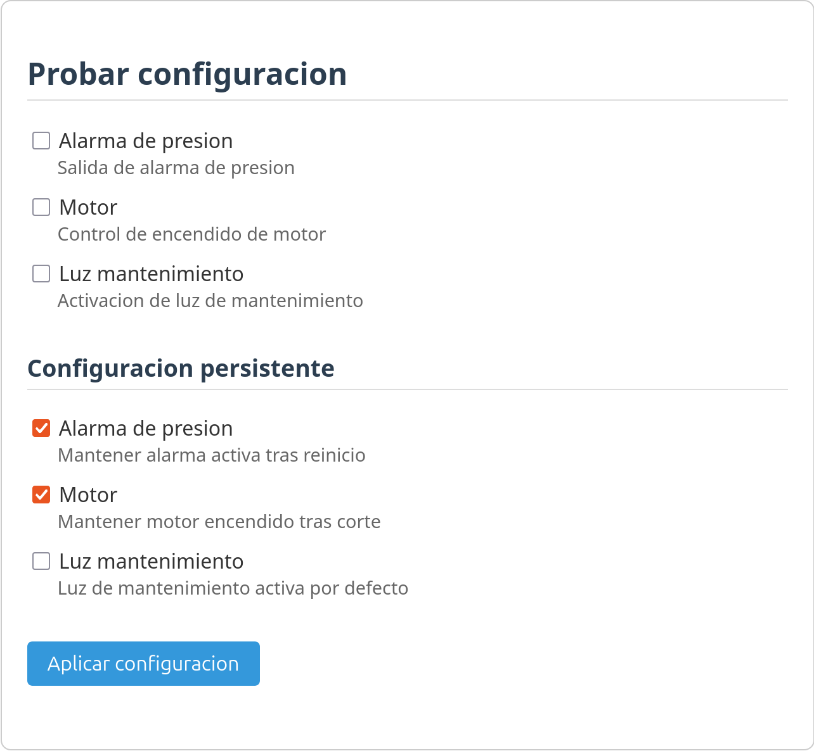

# Sistema de Configuración Web para Dispositivos Embebidos

Sistema de configuración persistente basado en ESP32 que reemplaza interfaces físicas limitadas (LCD + botones) por un captive portal web servido directamente desde el microcontrolador.

*Figura 1: Flujo de uso completo. El usuario se conecta a la red WiFi del ESP32, es redirigido automáticamente al portal web donde visualiza y modifica la configuración. Los cambios se almacenan en memoria no volátil (NVS) y persisten tras reinicios, aplicándose directamente al hardware de la máquina.*

## Especificaciones Técnicas

| Componente | Tecnología / Especificación |
| :--- | :--- |
| **Microcontrolador** | ESP32-WROOM (Xtensa Dual-Core) |
| **Modo de Red** | Access Point (AP) con Captive Portal |
| **Protocolos** | HTTP (Servidor Web), DNS Hijacking |
| **Persistencia** | Non-Volatile Storage (NVS) de ESP-IDF |
| **Framework** | ESP-IDF v5.4.1 |
| **Interfaz** | HTML/CSS/JS servido desde flash |

## Implementación y Validación

  

    
    
<i>Figura 2: Interface web servida desde el ESP32. Permite probar configuraciones temporalmente y guardarlas de forma persistente en NVS.</i>

  

  

    
    
<i>Figura 3: Prueba física con smartphone conectado al portal. La redirección automática (captive portal) funciona en dispositivos reales.</i>

  

<table style="width:100%; margin: 20px 0;">
  <tr>
    <td style="width:50%; padding:10px;">
      
    </td>
    <td style="width:50%; padding:10px;">
      
    </td>
  </tr>
  <tr>
    <td>
      
<i>Figura 4: Configuración física 1 aplicada. LEDs representan estados de salidas GPIO mapeados a funciones específicas.</i>

    </td>
    <td>
      
<i>Figura 5: Configuración física 2 aplicada. Cambios realizados desde la web se reflejan inmediatamente en el hardware.</i>

    </td>
  </tr>
</table>

## Valor del Sistema

Este sistema demuestra que una solución de configuración web robusta y profesional es alcanzable con hardware mínimo y coste reducido. El uso de un solo ESP32, sin componentes externos, mantiene la implementación simple y económica mientras entrega funcionalidad completa.

El desarrollo se aceleró partiendo de la plantilla oficial `captive_portal` de ESP-IDF, sobre la cual se construyeron las capas de abstracción de configuración y persistencia. Esto permitió enfocar el esfuerzo en la lógica de aplicación en lugar de diseñar componentes de red ya probados.

El resultado es un sistema que funciona de inmediato al conectarse, con tiempos de respuesta bajos y persistencia de configuración verificada tras múltiples ciclos de reinicio. Una solución práctica para despliegues reales en entornos técnicos e industriales.

