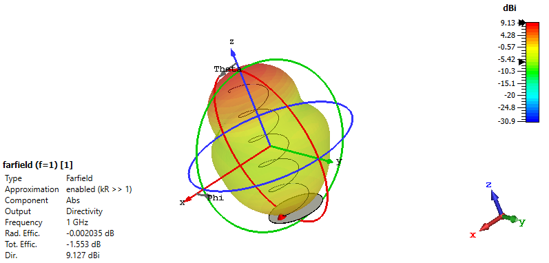
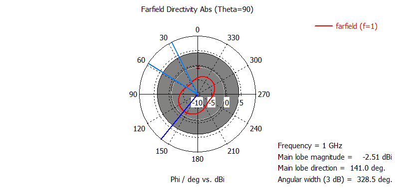

# Antena Helicoidal en Modo Axial (RHCP)

**Configuración de diseño:** Antena helicoidal de $N=5$ vueltas, optimizada para polarización circular derecha (RHCP) en la frecuencia objetivo de $f = 1\,\text{GHz}$. La geometría se dimensionó para forzar el modo axial: diámetro $D = \lambda/\pi \approx 95.5\,\text{mm}$ y paso $S = \lambda/4 \approx 75.0\,\text{mm}$, montada sobre un plano de tierra de diámetro $\lambda/2$.

## Parámetros en $1\,\text{GHz}$

| Parámetro | Valor |
| :--- | :--- |
| **Frecuencia de operación** | $1.0\,\text{GHz}$ |
| **Modo de polarización** | RHCP (Right-Hand Circular Polarization) |
| **Directividad máxima** | $9.13\,\text{dBi}$ |
| **Ancho de haz ($-3\,\text{dB}$)** | $54.8^\circ$ |
| **Relación axial (AR) en eje** | $\approx 0\,\text{dB}$ |
| **Eficiencia de radiación** | $-0.002\,\text{dB}$ ($\approx 99.95\%$) |
| **Eficiencia total** | $-1.55\,\text{dB}$ ($\approx 70\%$) |

## Patrón de Radiación 3D y Verificación del Modo

**Figura 1 - Diagrama de radiación 3D.** Visualización del patrón en $1\,\text{GHz}$. El lóbulo principal pronunciado y direccional a lo largo del eje de la hélice $(+Z)$ es la firma inequívoca de la operación en el modo axial deseado.

## Calidad del Haz y Polarización Circular

<table>
<tr>
<td width="50%">

<em>Figura 2 - Corte del patrón (Plano axial)</em>

</td>
<td width="50%">

<em>Figura 3 - Relación Axial (AR) en el plano axial</em>

</td>
</tr>
</table>

**Figura 2 & 3 - Análisis conjunto.** El corte del patrón (Figura 2) cuantifica la directividad ($9.13\,\text{dBi}$) y el ancho de haz ($54.8^\circ$). La gráfica de Relación Axial (Figura 3) valida la calidad de la polarización circular: un valor de AR cercano a $0\,\text{dB}$ en la dirección del eje $(\theta = 0^\circ)$ confirma una polarización circular derecha (RHCP) casi perfecta en el corazón del lóbulo principal, cumpliendo con el objetivo de diseño más exigente de esta antena.

## Patrón en el Plano Transversal

**Figura 4 - Patrón en plano transversal.** Corte en el plano $XY$ ($\theta = 90^\circ$), perpendicular al eje de la antena. Muestra una directividad baja ($-2.51\,\text{dBi}$) y un patrón casi omnidireccional, confirmando que la radiación se concentra efectivamente en el frente de la hélice y no se dispersa por los costados.

## Conclusión del Diseño
El diseño logra con éxito una antena helicoidal operando en el modo axial, combinando una directividad apreciable con una polarización circular de alta calidad. La relación axial cercana a $0\,\text{dB}$ en el eje del haz es un resultado particularmente destacable, que valida la precisión del dimensionado geométrico y la correcta excitación del modo. Este conjunto de características la convierte en un modelo efectivo para aplicaciones que requieren polarización circular y radiación direccional, como en enlaces satelitales o de telemetría.