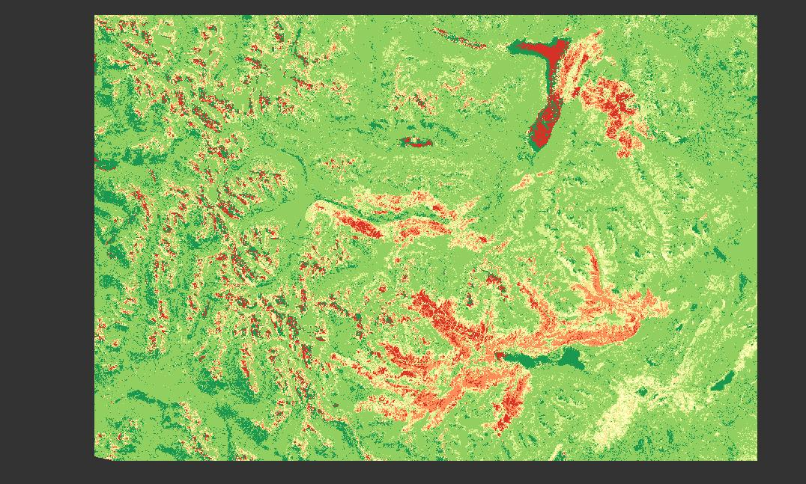

# Análisis de Teledetección Ambiental  
*Monitoreo de cambios en cobertura terrestre mediante imágenes Landsat*

Este conjunto de trabajos aplica técnicas de teledetección óptica para analizar tres fenómenos ambientales críticos en Argentina: deforestación en el noroeste, incendios en la Patagonia y dinámica de nieve/glaciares en Cuyo. Cada caso utiliza índices espectrales específicos procesados con **ESA SNAP** a partir de imágenes Landsat, siguiendo metodologías estandarizadas en la literatura científica.

---

## Resumen de proyectos

| Proyecto | Ubicación | Período | Índice utilizado | Satélite | Producto |
|----------|-----------|---------|------------------|----------|----------|
| Deforestación | Joaquín V. González, Salta | 1986–2017 | NDVI | Landsat 5 / Landsat 8 | Mapa de cambio de cobertura |
| Incendios | Lago Cholila, Chubut | Enero–Abril 2015 | NBR / ΔNBR | Landsat 8 | Mapa de severidad de quemado |
| Glaciares/Nieve | Cerro de la Majadita, San Juan | 2018 (estacional) | Snow Index (SI) | Landsat 8 | Mapa de dinámica estacional |

---

## 1. Deforestación en el noroeste argentino

**Contexto:** La región del Chaco Salteño ha experimentado una fuerte transformación por expansión agrícola. Este análisis cuantifica la pérdida de bosque nativo alrededor de Joaquín V. González entre 1986 y 2017.

**Metodología:**
- Descarga de imágenes Landsat 5 (1986) y Landsat 8 (2017), path 230, row 77.
- Cálculo del **Índice de Vegetación de Diferencia Normalizada (NDVI)** para cada fecha:

  $$
  \text{NDVI} = \frac{\text{NIR} - \text{Rojo}}{\text{NIR} + \text{Rojo}}
  $$

- Clasificación no supervisada (k-means, 3 clases) del NDVI apilado.
- Asignación de categorías:
  - **Verde:** Vegetación conservada (alto NDVI sin cambio).
  - **Naranja:** Áreas con disminución de NDVI por pérdida de bosque.
  - **Amarillo:** Zonas de baja vegetación sin cambios significativos.

**Resultado:** El mapa evidencia un patrón claro de reducción de áreas verdes, correspondiente a la frontera agropecuaria en expansión. La técnica permite cuantificar la superficie transformada y localizar los focos de deforestación.

---

## 2. Incendios en la Patagonia

**Contexto:** En 2015, un incendio de grandes dimensiones afectó la región de Lago Cholila (Chubut). Este trabajo evalúa la severidad del daño mediante el Índice de Quemado Normalizado.

**Metodología:**
- Imágenes Landsat 8 previa (21/01/2015) y posterior (11/04/2015) al incendio, path 232, row 89.
- Cálculo del **Normalized Burn Ratio (NBR)** para cada escena:

  $$
  \text{NBR} = \frac{\text{NIR} - \text{SWIR2}}{\text{NIR} + \text{SWIR2}}
  $$

- Obtención de la diferencia temporal (**ΔNBR**):

  $$
  \Delta\text{NBR} = \text{NBR}_{\text{pre}} - \text{NBR}_{\text{post}}
  $$

- Clasificación por umbrales en siete categorías de severidad, desde "recrecimiento vegetal" hasta "severidad alta de incendio".

**Resultado:** La zona núcleo del incendio muestra valores altos de ΔNBR (tonos rojos), indicando severidad moderada-alta. Las áreas periféricas presentan menor severidad, mientras que algunos sectores verdes sugieren rebrote post-fuego.

---

## 3. Dinámica estacional de nieve y glaciares en Cuyo

**Contexto:** La criósfera andina es un reservorio estratégico de agua. Este análisis identifica la cobertura nival permanente y estacional en el Cerro de la Majadita (San Juan) durante 2018.

**Metodología:**
- Imágenes Landsat 8 de verano (04/01/2018) e invierno (15/07/2018), path 233, row 81.
- Cálculo del **Snow Index (SI)** para cada fecha:

  $$
  \text{SI} = \frac{\text{Rojo}}{\text{SWIR1}}
  $$

- Determinación de un umbral espectral para discriminar áreas con nieve.
- Combinación binaria de las capas de verano e invierno para obtener cuatro clases:
  - Sin nieve
  - Nieve solo en verano
  - Nieve solo en invierno
  - Nieve permanente (todo el año)

**Resultado:** Se identifican claramente los cuerpos de nieve/hielo permanente (azul oscuro), cruciales para el aporte hídrico estacional. La distribución de nieve estacional refleja el gradiente altitudinal y la exposición de laderas.

---

## Aspectos técnicos destacados

- **Software:** Procesamiento realizado con **ESA SNAP**, herramienta estándar en teledetección óptica.
- **Datos:** Imágenes Landsat Collection 2 Level 2, con correcciones atmosféricas ya aplicadas.
- **Índices espectrales:** Selección adecuada según el fenómeno estudiado (NDVI, NBR, SI).
- **Análisis temporal:** Comparación multitemporal para capturar dinámicas de cambio.
- **Cartografía temática:** Generación de mapas listos para interpretación visual, con paletas de color informativas.

---

## Reflexión final

Estos trabajos demuestran la capacidad de la teledetección para monitorear cambios ambientales a escala regional con rigor cuantitativo. La elección de índices adecuados, el procesamiento consistente en SNAP y la interpretación contextual de los resultados permiten transformar datos satelitales en información útil para la gestión territorial y ambiental.

**Herramientas:** ESA SNAP, Landsat 5/8 (USGS), QGIS (visualización).  
**Fecha:** Mayo 2024  
**Autor:** Simón Aulet  
**Formación:** Curso "Teledetección Óptica" - CONAE (Comisión Nacional de Actividades Espaciales)