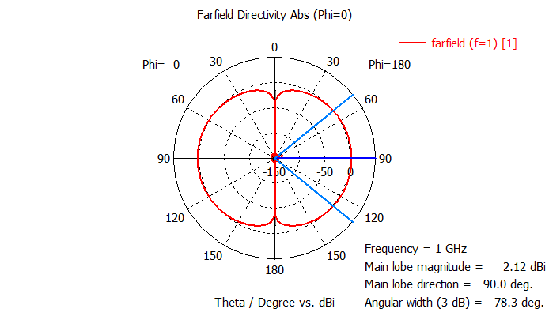
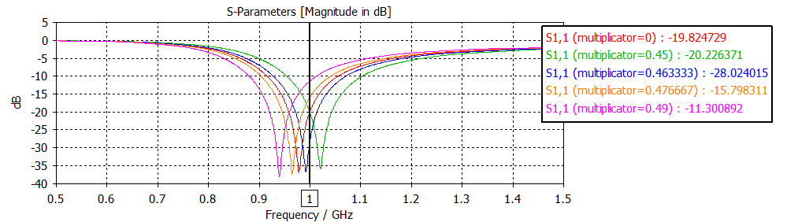
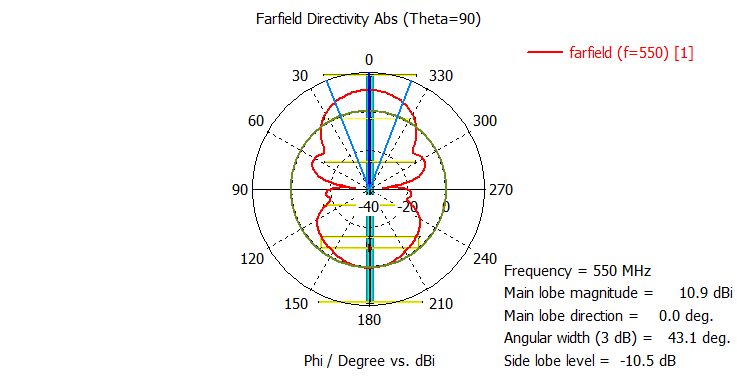
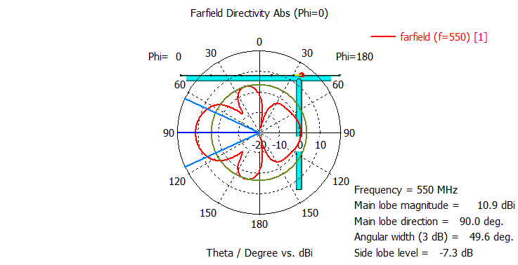
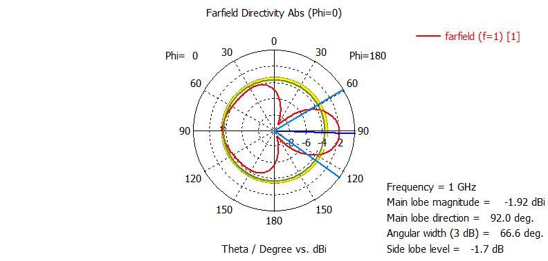
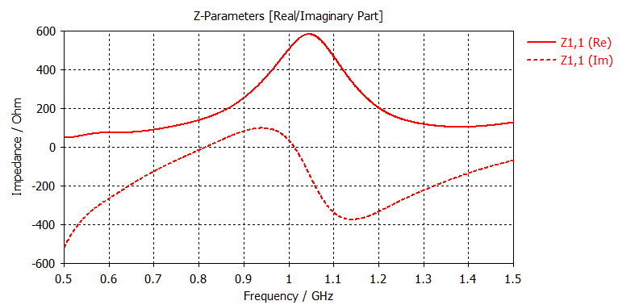

# Antenas Simuladas - Compilación de Diseños

## 1. Antena Dipolo de Media Onda ($\lambda / 2$) - Sintonizado

**Configuración:** Dipolo delgado alimentado en el centro, orientado en $Z$. Dimensiones finales optimizadas mediante *parameter sweep*.

### 1.1 Parámetros en $1\text{ }\text{GHz}$

| Parámetro | Valor |
| :--- | :--- |
| **Frecuencia de resonancia** | $1.0\text{ }\text{GHz}$ |
| **$S_{11}$ mínimo** | $-28.0\text{ }\text{dB}$ |
| **Directividad máxima** | $2.12\text{ }\text{dBi}$ |
| **Eficiencia total** | $-0.1715\text{ }\text{dB}$ ($\sim 96$ %) |
| **Eficiencia de radiación** | $0.001466\text{ }\text{dB}$ ($\sim 99.9$%) |
| **Ancho de haz ($-3\text{ }\text{dB}$) - Plano $E$** | 78.3 $^\circ$ |

### 1.2 Patrón de Radiación 3D y Cortes Principales

**Figura 1.1 - Patrón de radiación 3D.** Visualización en escala logarítmica de la directividad. Muestra el patrón toroidal ("donut") característico, con máximos en el plano ecuatorial $(XY)$ y nulos en el eje del dipolo $(Z)$. Este resultado corresponde a la longitud de dipolo sintonizada tras un barrido paramétrico (*parameter sweep*).

<table>
<tr>
<td width="50%">

<em>Figura 1.2 - Corte Plano $E$ ($\phi=0^\circ$)</em>

</td>
<td width="50%">

<em>Figura 1.3 - Corte Plano $H$ ($\theta=90^\circ$)</em>

</td>
</tr>
</table>

**Figura 1.2 & 1.3 - Patrones en planos $E$ y $H$.** El corte en el **Plano $E$** (que contiene al dipolo) muestra el diagrama clásico de dos lóbulos con un ancho de haz de $78.3^\circ$. El corte en el **Plano $H$** (perpendicular al dipolo) valida la omnidireccionalidad teórica.

### 1.3 Optimización y Respuesta en Frecuencia

**Figura 1.4 - Optimización de impedancia.** Curva del parámetro $S_{11}$ para el factor de longitud óptimo (**$0.463333\lambda$**), obtenido tras un barrido paramétrico (mult. de $0.45$ a $0.49\lambda$). El mínimo de **$-28\text{ }\text{dB}$ a $1\text{ }\text{GHz}$** confirma la sintonía precisa lograda y una adaptación de impedancia óptima.

### 1.4 Conclusión del Diseño
El dipolo fue modelado y optimizado sistemáticamente mediante un parameter sweep de su longitud, logrando una resonancia precisa a $1\text{ }\text{GHz}$ con un $S_{11}$ de $-28\text{ }\text{dB}$. El patrón de radiación obtenido coincide con la teoría, presentando una directividad de $2.12\text{ }\text{dBi}$ y eficiencias superiores al $96$ %, validando la calidad de la simulación y el proceso de sintonía.

---

## 2. Antena Helicoidal en Modo Axial (RHCP)

**Configuración de diseño:** Antena helicoidal de $N=5$ vueltas, optimizada para polarización circular derecha (RHCP) en la frecuencia objetivo de $f = 1\text{ }\text{GHz}$. La geometría se dimensionó para forzar el modo axial: diámetro $D = \lambda/\pi \approx 95.5\text{ }\text{mm}$ y paso $S = \lambda/4 \approx 75.0\text{ }\text{mm}$, montada sobre un plano de tierra de diámetro $\lambda/2$.

### 2.1 Parámetros en $1\text{ }\text{GHz}$

| Parámetro | Valor |
| :--- | :--- |
| **Frecuencia de operación** | $1.0\text{ }\text{GHz}$ |
| **Modo de polarización** | RHCP (Right-Hand Circular Polarization) |
| **Directividad máxima** | $9.13\text{ }\text{dBi}$ |
| **Ancho de haz ($-3\text{ }\text{dB}$)** | $54.8^\circ$ |
| **Relación axial (AR) en eje** | $\approx 0\text{ }\text{dB}$ |
| **Eficiencia de radiación** | $-0.002\text{ }\text{dB}$ ($\approx 99.95$ %) |
| **Eficiencia total** | $-1.55\text{ }\text{dB}$ ($\approx 70$ %) |

### 2.2 Patrón de Radiación 3D y Verificación del Modo

**Figura 2.1 - Diagrama de radiación 3D.** Visualización del patrón en $1\text{ }\text{GHz}$. El lóbulo principal pronunciado y direccional a lo largo del eje de la hélice $(+Z)$ es la firma inequívoca de la operación en el modo axial deseado.

### 2.3 Calidad del Haz y Polarización Circular

<table>
<tr>
<td width="50%">

<em>Figura 2.2 - Corte del patrón (Plano axial)</em>

</td>
<td width="50%">

<em>Figura 2.3 - Relación Axial (AR) en el plano axial</em>

</td>
</tr>
</table>

**Figura 2.2 & 2.3 - Análisis conjunto.** El corte del patrón (Figura 2.2) cuantifica la directividad ($9.13\text{ }\text{dBi}$) y el ancho de haz ($54.8^\circ$). La gráfica de Relación Axial (Figura 2.3) valida la calidad de la polarización circular: un valor de AR cercano a $0\text{ }\text{dB}$ en la dirección del eje $(\theta = 0^\circ)$ confirma una polarización circular derecha (RHCP) casi perfecta en el corazón del lóbulo principal, cumpliendo con el objetivo de diseño más exigente de esta antena.

### 2.4 Patrón en el Plano Transversal

**Figura 2.4 - Patrón en plano transversal.** Corte en el plano $XY$ ($\theta = 90^\circ$), perpendicular al eje de la antena. Muestra una directividad baja ($-2.51\text{ }\text{dBi}$) y un patrón casi omnidireccional, confirmando que la radiación se concentra efectivamente en el frente de la hélice y no se dispersa por los costados.

### 2.5 Conclusión del Diseño
El diseño logra con éxito una antena helicoidal operando en el modo axial, combinando una directividad apreciable con una polarización circular de alta calidad. La relación axial cercana a $0\text{ }\text{dB}$ en el eje del haz es un resultado particularmente destacable, que valida la precisión del dimensionado geométrico y la correcta excitación del modo. Este conjunto de características la convierte en un modelo efectivo para aplicaciones que requieren polarización circular y radiación direccional, como en enlaces satelitales o de telemetría.

---

## 3. Antena Yagi-Uda para UHF (6 elementos)

**Objetivo de diseño:** Antena direccional para $550 \text{ } \text{MHz}$ con directividad $>10 \text{ } \text{dBi}$.

### 3.1 Parámetros de Diseño y Resultados

| Parámetro | Valor | Parámetro | Valor |
| :--- | :--- | :--- | :--- |
| **Frecuencia central ($f_0$)** | $550 \text{ } \text{MHz}$ | **Longitud de onda ($\lambda$)** | $0.545 \text{ } \text{m}$ |
| **Directividad alcanzada ($D_0$)** | $10.87 \text{ } \text{dBi}$ | **Pérdidas por retorno** | $20.0 \text{ } \text{dB}$ |
| **Ancho de haz (-3 dB) (Plano E)** | $43.1^\circ$ |**Nivel de lóbulo lateral (Plano E)** | $-10.5 \text{ } \text{dB}$ |
| **Eficiencia total** | $-0.082 \text{ } \text{dB} \text{ } (\sim98$ %) | **Relación Delante/Atrás (aprox.)** | $10.9 \text{ } \text{dB}$ |

### 3.2 Dimensiones Clave

**Dimensiones clave (basadas en NBS Tech. Note 688):**

| Elemento | Dimensión |
| :--- | :--- |
| Reflector (L1) | $48.2 \text{ } \text{cm}$ |
| Dipolo plegado (L2) | $24.8 \text{ } \text{cm}$ |
| Directores (L3-L6) | $42.8 \text{ } \text{cm} - 42.0 \text{ } \text{cm}$ |
| Espaciado entre directores | $25.0 \text{ } \text{cm}$ |
| Radio de elementos (Al) | $2.32 \text{ } \text{mm}$ ($0.232 \text{ } \text{cm}$) |

### 3.3 Modelo y Respuesta de la Antena

**Figura 3.1 - Modelo Físico.** Estructura simulada con 6 elementos: un reflector, un dipolo plegado activo y 4 directores. Los elementos conductores son de aluminio hueco, montados en una barra portante de PVC. El dipolo plegado, sintonizado para una impedancia cercana a $200 \text{ } \Omega$, se adapta a $50 \text{ } \Omega$ mediante un balun $4:1$ realizado con coaxial de $50\Omega$, facilitando la conexión directa.

### 3.4 Características de Radiación

**Figura 3.2 - Patrón de Radiación 3D.** Diagrama de directividad en escala logarítmica. Se confirma la directividad de $10.87 \text{ } \text{dBi}$ y la alta eficiencia de radiación ($-0.037 \text{ } \text{dB}$).

<table>
<tr>
<td width="50%">

<em>Figura 3.3 - Corte Plano E (vista superior, $\theta = 90^\circ$)</em>

</td>
<td width="50%">

<em>Figura 3.4 - Corte Plano H (vista lateral, $\phi = 0^\circ$)</em>

</td>
</tr>
</table>

**Figura 3.3 & 3.4 - Cortes en Planos Principales.** El **Plano E** (que contiene los elementos) muestra el lóbulo principal más estrecho ($43.1^\circ$) y mejor supresión de lóbulos laterales. El **Plano H** presenta un haz ligeramente más ancho ($49.6^\circ$).

### 3.5 Respuesta Eléctrica y Adaptación

**Figura 3.5 - Parámetro de Reflexión ($S_{11}$).** La curva muestra un mínimo de $-20.0 \text{ } \text{dB}$ en la frecuencia central de $550 \text{ } \text{MHz}$, superando el requisito de pérdidas por retorno $> 15 \text{ } \text{dB}$.

**Figura 3.6 - Impedancia de Entrada ($Z_{in}$).** En $550 \text{ } \text{MHz}$, la impedancia es $Z_{in} = 207.6 - j5.44 \text{ } \Omega$. La componente real cercana a $200 \text{ } \Omega$ es perfecta para el balun $4:1$, y la pequeña reactancia ($-j5.44 \text{ } \Omega$) despreciable.

### 3.6 Conclusión del Diseño
El diseño resultó en una antena Yagi-Uda práctica y de alto rendimiento para UHF, que supera holgadamente las especificaciones iniciales. La elección de un dipolo plegado como radiante simplifica enormemente la adaptación: su impedancia natural de $\sim 200 \text{ } \Omega$ se conjuga perfectamente con un balun $4:1$ construible con un simple tramo de coaxial, eliminando la necesidad de circuitos impresos o componentes discretos.

---

## 4. Antena Loop de Perímetro 1.3 $\lambda$

**Objetivo:** Análisis de una antena loop circular de perímetro $C = 1.3\lambda$ operando a $1 \text{ } \text{GHz}$, para estudiar sus características en modo no dipolo magnético debido a su gran tamaño eléctrico.

### 4.1 Parámetros de Diseño y Resultados en $f_0$

| Parámetro | Valor |
| :--- | :--- |
| **Frecuencia de operación ($f_0$)** | $1 \text{ } \text{GHz}$ |
| **Perímetro de la circunferencia ($C$)** | $1.3\lambda$ |
| **Radio del conductor (Cu)** | $4 \text{ } \text{mm}$ |
| **Directividad máxima** | $4.38 \text{ } \text{dBi}$ |
| **Eficiencia de radiación** | $-0.0024 \text{ } \text{dB} \text{ }$ ($\sim 99.9$ %) |
| **Eficiencia total** | $-4.86 \text{ } \text{dB} \text{ }$ ($\sim 32$ %) |

### 4.2 Caracterización del Modo de Radiación

**Figura 4.1 - Patrón 3D complejo.** Para un loop de $1.3\lambda$, el diagrama deja de ser el toroide simple de un dipolo magnético. Se observa una estructura multilobulada, indicativa de una distribución de corriente no uniforme a lo largo del conductor, característica de loops eléctricamente grandes.

<table>
<tr>
<td width="50%">

<em>Figura 4.2 - Corte Plano E ($\phi = 0^\circ$)</em>

</td>
<td width="50%">

<em>Figura 4.3 - Corte Plano H ($\theta = 90^\circ$)</em>

</td>
</tr>
</table>

**Figura 4.2 & 4.3 - Patrones en planos E y H.** Ambos cortes presentan lóbulos secundarios y nulos pronunciados, lo que confirma que la antena ya no opera en el modo de dipolo magnético. La directividad medida ($4.38 \text{ } \text{dBi}$) es superior a la de un loop pequeño.

### 4.3 Análisis de Impedancia y Respuesta en Frecuencia

**Figura 4.4 - Impedancia de entrada vs. Frecuencia.** La gráfica muestra la evolución de los parámetros $Z$ en un barrido de $0.5$ a $1.5 \text{ } \text{GHz}$. En la frecuencia de diseño ($1 \text{ } \text{GHz}$), la impedancia es $Z_{in} \approx 500 + j30 \text{ } \Omega$.

La **alta resistencia de radiación ($\sim 500 \text{ } \Omega$)** es un resultado directo del gran tamaño eléctrico del loop ($1.3\lambda$), que lo aleja del comportamiento de un dipolo magnético de baja impedancia. Esta desadaptación extrema con la impedancia de referencia del puerto ($50 \text{ } \Omega$) es la causa principal de la baja eficiencia total ($-4.86 \text{ } \text{dB}$), ya que provoca una alta reflexión de potencia a pesar de la excelente eficiencia de radiación intrínseca de la estructura.

### 4.4 Conclusión del Análisis
La simulación del loop de $1.3\lambda$ confirmó las propiedades distintivas de una antena de gran tamaño eléctrico: un patrón de radiación complejo y multilobulado y una alta resistencia de radiación ($\sim 500 \text{ } \Omega$). La combinación de una excelente eficiencia de radiación con una baja eficiencia total evidencia la necesidad de un sistema de adaptación de impedancia en este tipo de diseños.
