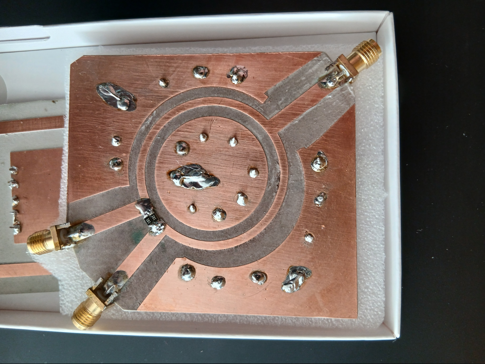

# Divisor de Potencia Wilkinson – 1 GHz  
Diseño, fabricación CNC y medición en RF

Este proyecto consistió en el desarrollo completo de un divisor de potencia de Wilkinson balanceado para operar a 1 GHz, desde la simulación electromagnética en ADS hasta la fabricación física con router CNC y la validación experimental mediante un analizador de redes vectoriales.
El resultado es un divisor que divide la potencia de entrada en dos señales de igual amplitud ($-3$ dB) con alto aislamiento entre puertos y excelente adaptación de impedancia.

---

## Especificaciones clave

| Parámetro | Valor |
|-----------|-------|
| Frecuencia central | $1$ GHz |
| Sustrato | Rogers RT/duroid 5880LZ |
| Constante dieléctrica ($\varepsilon_r$) | $2.00 \pm 0.04$ |
| Espesor del dieléctrico | $1.27$ mm ($0.05$ inch) |
| Espesor del cobre | $35$ $\mu$m |
| Impedancia de línea ($Z_0$) | $50$ $\Omega$ |
| Impedancia de los brazos ($Z$) | $\sqrt{2}Z_0 \approx 70.7$ $\Omega$ |
| Resistencia de aislamiento | $90$ $\Omega$ (ideal $100$ $\Omega$) |
| Tecnología de fabricación | Fresado CNC (Wegstr) |
| Instrumento de medición | VNA Rohde & Schwarz ZNC3-2Port |

---

## Diseño y simulación

El diseño comenzó con un esquemático en **Keysight ADS** donde se modelaron los transformadores de $\lambda/4$ y la resistencia de aislamiento.
Se optó por un diseño balanceado ($P_2 = P_3 = P_1/2$), lo que implica que ambas salidas deben presentar una atenuación de $-3$ dB respecto a la entrada.

Para el layout físico se reemplazaron los tramos rectos por **arcos de radio calculado**, lo que permitió:
- Maximizar el aislamiento entre las pistas.
- Eliminar ángulos agudos que degradan el desempeño en RF.

La simulación electromagnética mostró un comportamiento cercano al ideal en la banda de interés, aunque se observó un ligero desplazamiento en frecuencia atribuido a diferencias entre las propiedades del sustrato teórico y el real.

---

## Fabricación con router CNC

Los archivos Gerber generados a partir del layout se enviaron a una fresadora CNC Wegstr, capaz de una repetitividad de $0.02$ mm.  
Para reducir el desgaste de la mecha, se añadió manualmente un "relleno" de cobre alrededor de las pistas, manteniendo una separación de aproximadamente dos anchos de pista entre las trazas y la masa.

El proceso de fresado fue limpio y preciso, resultando en pistas bien definidas y bordes nítidos.  
Posteriormente se soldaron **conectores SMA** en cada puerto, y se agregaron puntos de estaño para conectar la masa superior con la inferior, evitando así acoplamientos parásitos.

---

## Prototipo terminado

El dispositivo final es compacto, robusto y listo para medición.  
Los conectores SMA permiten una conexión directa al VNA mediante cables de calibración.

La resistencia de $90$ $\Omega$ (visible en el centro) se seleccionó por disponibilidad en el laboratorio, aunque el valor ideal es $2Z_0 = 100$ $\Omega$.  
Aun así, el aislamiento medido superó los $-20$ dB en la frecuencia central.

---

## Resultados y validación

Las mediciones se realizaron con un **analizador de redes vectoriales Rohde & Schwarz ZNC3**.  
Los parámetros $S$ obtenidos confirmaron el comportamiento esperado:

- **$S_{21}$ y $S_{31}$**: $\approx -3$ dB a $1$ GHz -> división equilibrada.
- **$S_{11}$**: mejor que $-20$ dB -> excelente adaptación en el puerto de entrada.
- **$S_{23}$**: mejor que $-20$ dB -> alto aislamiento entre salidas.

Se observó cierto *ripple* en la respuesta en frecuencia, pero pruebas adicionales descartaron que fuera causado por el divisor; más bien se atribuyó a imperfecciones en los cables y conectores del sistema de medición.

---

## Análisis detallado con Python

Para un procesamiento más profundo de los datos, se desarrolló un Jupyter Notebook con `scikit-rf` y `matplotlib` que permite:
- Cargar archivos de parámetros $S$ (.s2p) tanto de la simulación como del VNA.
- Comparar gráficamente respuestas ideales, simuladas y medidas.
- Aplicar correcciones (como la deadaptación de cables) y evaluar su efecto.

Se puede ver el análisis completo aquí: [Analisis.ipynb](https://github.com/SimonAulet/Analisis-Wilkinson/blob/main/Analisis.ipynb)

---

## Conclusión

El divisor de Wilkinson fabricado demuestra un nivel profesional de implementación en RF, cumpliendo con todas las especificaciones críticas en la frecuencia objetivo de $1$ GHz. El proyecto valida un flujo de trabajo integral que combina herramientas de alto nivel (ADS para simulación EM, VNA Rohde & Schwarz para caracterización) con materiales especializados (sustrato Rogers 5880LZ) y técnicas de fabricación precisas (fresado CNC).

**Logros destacables:**
- División balanceada ($-3$ dB) con aislamiento $>20$ dB.
- Adaptación excelente en todos los puertos ($S_{11} < -20$ dB).
- Fabricación limpia y repetible mediante CNC.
- Flujo de trabajo validado: ADS -> Gerber -> CNC -> VNA -> Python.

**Aprendizaje:**  
La discrepancia entre la frecuencia simulada y la medida resalta la importancia de usar las propiedades reales del sustrato desde la etapa inicial del diseño. Para futuras iteraciones, una optimización EM iterativa permitiría corregir este desplazamiento y afinar aún más el ancho de banda.

---

**Repositorio completo:** [github.com/SimonAulet/Analisis-Wilkinson](https://github.com/SimonAulet/Analisis-Wilkinson)  
**Herramientas:** Keysight ADS, Wegstr CNC, Rohde & Schwarz ZNC3, Python (scikit-rf, matplotlib).
